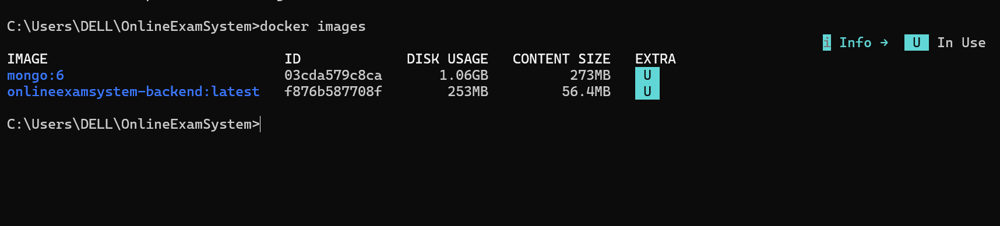

# Online Exam System

## 👥Group Information
- **Student 1:** L. C. Isuranga Silva - ITBIN-2313-0109 - Role: DevOps Engineer / Release Manager
- **Student 2:** J. A. B. B. Jayakody - ITBIN-2313-0044 - Role: Backend Developer
- **Student 3:** W. P. S. Weerasinghe - ITBIN-2313-0123 - Role: Frontend Developer

---

## 📌Project Description
The Online Exam System is a web-based application that allows students to register, log in, attend online examinations, and view results.  
Administrators can manage users and exams through a secure backend.  
The project demonstrates real-world Git collaboration, CI/CD automation, and cloud deployment practices.

---

## 🌍Live Deployment
🔗 **Live URL:** https://online-exam-system.vercel.app

---

## 🛠Technologies Used
- HTML5, CSS3, JavaScript
- Node.js, Express.js
- MongoDB, Mongoose
- GitHub Actions
- Vercel

---

## ✨Features
- User registration and authentication
- Online exam interface for students
- Student dashboard and result viewing
- Secure backend APIs
- Responsive user interface
- Automated CI/CD pipeline
- Cloud-based deployment

---

## 🌿Branch Strategy
We implemented the following branching strategy:
- `main` - Production branch
- `develop` - Integration branch
- `feature/*` - Feature development branches

---

## 👤Individual Contributions

### L. C. Isuranga Silva
- Repository setup and initial configuration
- Git branching strategy implementation
- GitHub Actions CI pipeline implementation
- Deployment workflow setup and management
- Release coordination and deployment verification
- Merge conflict resolution
- Final documentation and README management

### J. A. B. B. Jayakody
- Backend architecture design
- RESTful API development using Express.js
- MongoDB database integration with Mongoose
- JWT-based authentication and authorization
- Backend middleware for security and error handling

### W. P. S. Weerasinghe
- Frontend UI design and implementation
- HTML page creation for exam workflow
- Client-side logic using JavaScript
- CSS styling and responsive layout
- Frontend feature documentation

---

## Setup Instructions

### Prerequisites
- Node.js (version 18 or higher)
- Git

## ⚙️ CI/CD Pipeline

### Continuous Integration (CI)
- Runs on every push and pull request  
- Ensures code consistency  
- Validates project structure  

### Continuous Deployment (CD)
- Triggered automatically on merge to the `main` branch  
- Deploys the latest production-ready version  

### Installation
```bash
# Clone the repository
git clone https://github.com/Chalana48/OnlineExamSystem.git

# Navigate to project directory
cd OnlineExamSystem

# Install dependencies (if applicable)
npm install

# Run development server (if applicable)
npm run dev

# Online Exam System - Docker Setup

This project is a backend service for an **Online Exam System**.  
The application is containerized using **Docker** and managed with **Docker Compose**.

## Technologies Used
- Node.js
- Express.js
- MongoDB
- Docker
- Docker Compose

## Project Structure

Assignment 2

OnlineExamSystem
│
├── Backend
│   ├── config
│   ├── controllers
│   ├── middleware
│   ├── models
│   ├── routes
│   ├── utils
│   ├── Dockerfile
│   ├── package.json
│   └── server.js
│
├── docker-compose.yml
└── README.md
```

## Run the Project Using Docker

### 1. Build Containers

```
docker compose build
```

### 2. Start Containers

```
docker compose up
```

### 3. Check Running Containers

```
docker ps
```

### 4. View Docker Images

```
docker images
```

## Docker Images

Below is the Docker images created for this project.



## Application URL

```
http://localhost:5000
```

## Database

MongoDB runs inside a Docker container and connects using:

```
mongodb://mongo:27017/examdb
```

## Stop Containers

```
docker compose down
```
